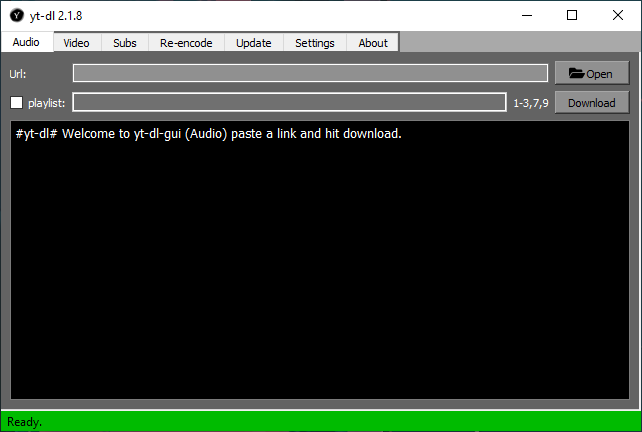
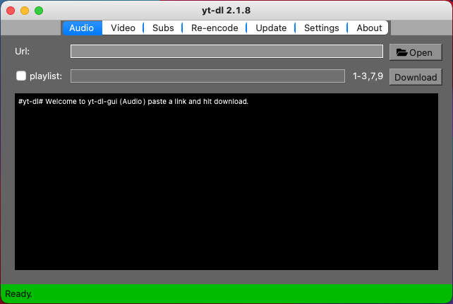
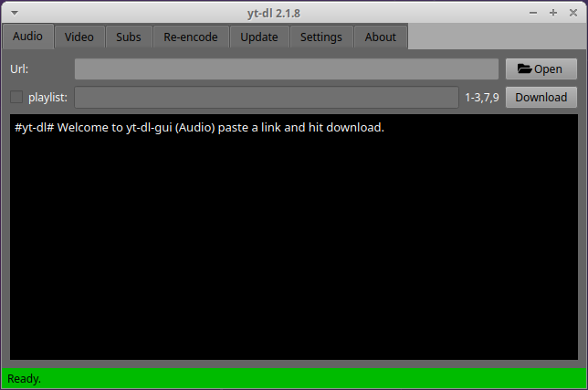
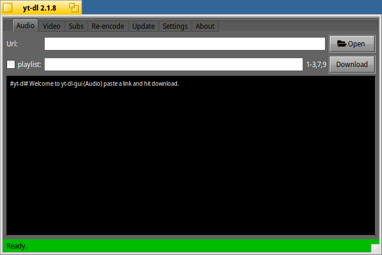
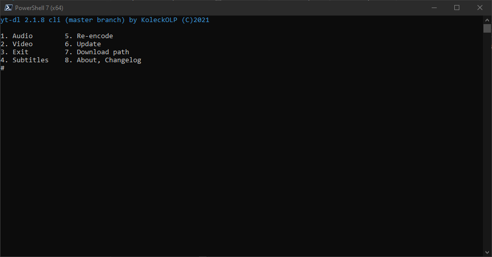

# yt-dl
Multiplatform CLI and GUI youtube-dl simplifier

### Rewritten in Python 3.

runs on any OS if you can get these
Requirements:
+ python3
+ PyQt5 (for GUI)
+ youtube-dl
+ ffmpeg, ffprobe
+ py-getch (for CLI)
+ colorama (for CLI)

#### To download private or age restricted videos use a browser extension to download your youtube.com cookies in netscape cookie file format and put the file into yt-dl directory as cookies.txt

    
Windows

1. install git: https://git-scm.com/download/win
2. install python3: https://www.python.org/downloads/
3. clone repo with git `git clone https://github.com/koleckolp/yt-dl`
    1. \(optional) update pip: `py -m pip install -U pip`
4. install requirements: `pip install -r req-gui5.txt`
5. download ffmpeg.exe and ffprobe.exe: https://ffbinaries.com/downloads and put them into the yt-dl directory
6. launch `pythonw gui5.py` (if you are missing a config hit ok and restart the app)
    1. \(recommended) on the settings tab fix your setting and Make Lauch Script
    2. than you can make a desktop shortcut from `yt-dl_gui.bat` or `yt-dl_gui.vbs` (which ever you like)

    
Mac

1. install git by typing git into terminal
2. install python3 and licences
    1. \(optional) update pip (with pip): `py -m pip install -U pip`
3. Add pip to path (I am lazy too explain google is your friend)
4. install requirements: `pip install -r req-gui5.txt`
5. download ffmpeg and ffprobe: https://ffbinaries.com/downloads and put them into the yt-dl directory
6. launch ffmpeg and ffprobe and allow them to run
7. launch `python gui5.py` (if you are missing a config hit ok and restart the app)
    1. \(recommended) on the settings tab fix your setting and Make Lauch Script
    2. than you can make a desktop shortcut from `yt-dl` pin it or move to apps or something, suit yourself 
(icon does not work and nav bar is centered might fix might not)

    
Linux

1. install git (with your package manager)
2. install python3 (with your package manager)
3. clone repo with git `git clone https://github.com/koleckolp/yt-dl`
    1. \(optional) update pip (with pip): `py -m pip install -U pip`
4. install requirements: `pip install -r req-gui5.txt`
5. install ffmpeg (with your package manager)
6. launch `python gui5.py` (if you are missing a config hit ok and restart the app)
    1. \(recommended) on the settings tab fix your setting and Make Lauch Script
    2. than you can make a desktop shortcut from `yt-dl`

    
Haiku

1. install git (from HaikuDepot)
2. install pyqt_x86_python3, python3_x86, pip_python3 (from HaikuDepot, or 64bit equivalent)
3. clone repo with git `git clone https://github.com/koleckolp/yt-dl`
4. install ffmpeg, ffmpeg-tools and youtube-dl (from HaikuDepot)
5. launch `python gui5.py` (if you are missing a config hit ok and restart the app)
6. launch `python gui5.py` (if you are missing a config hit ok and restart the app)
    1. \(recommended) on the settings tab fix your setting and Make Lauch Script
    2. than you can make a desktop shortcut from `yt-dl`

    
Cli (win,mac,lin,android)

1. install git
2. install python3
3. clone repo with git `git clone https://github.com/koleckolp/yt-dl`
    1. \(optional) update pip: `py -m pip install -U pip`
4. install requirements: `pip install -r req-cli.txt`
5. get ffmpeg and ffprobe(may come with ffmpeg, or ffmpeg-tools) and put them into the yt-dl directory
6. launch `pythonw main.py`
    1. \(recommended) on the settings (7) fix your setting and Make Lauch Script (3)
    2. than you can make a desktop shortcut from `yt-dl.bat` or `yt-dl` (which ever you get, don't forget to chmod +x on posix systems)

